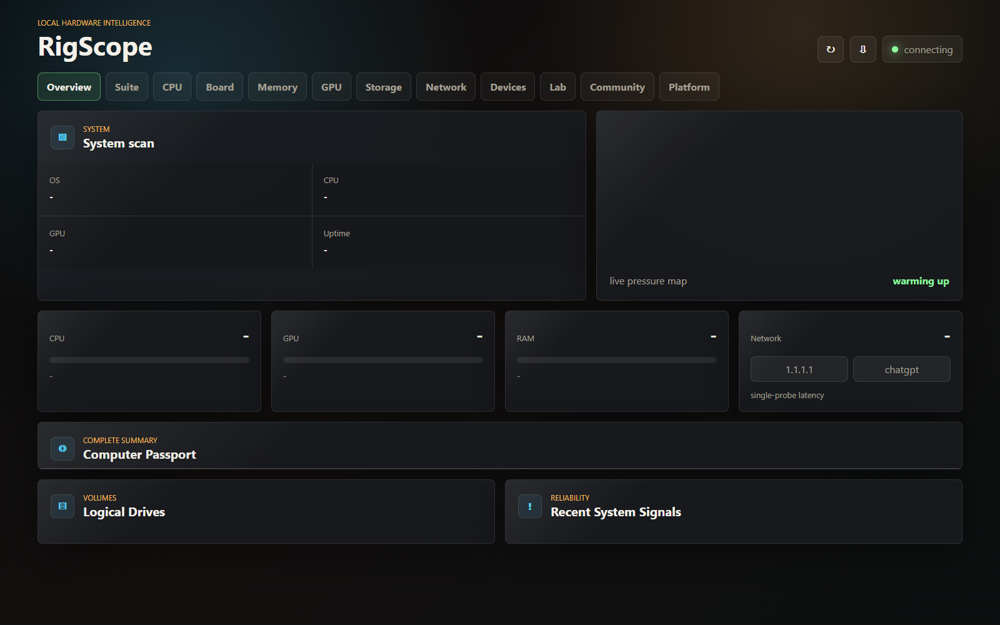
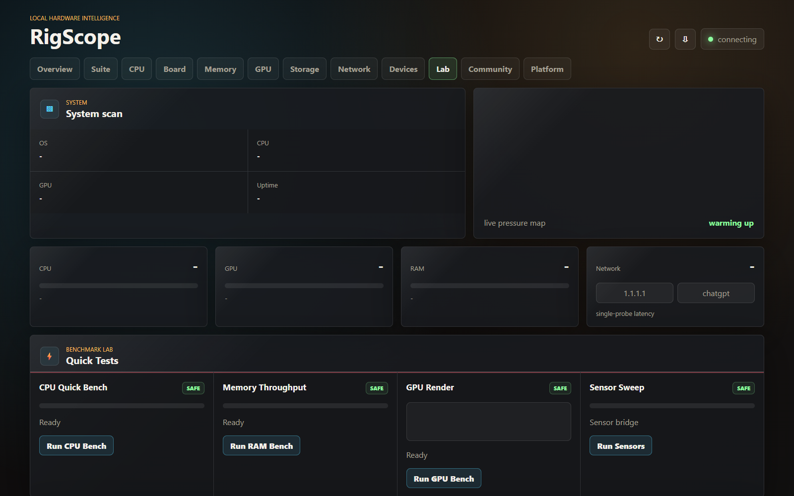

# RigScope

<p align="center">
  
</p>

<h3 align="center">One clean cockpit for your whole PC.</h3>

<p align="center">
  Hardware inventory, live telemetry, benchmarks, stress tests, native tool bridges, reports, and setup comparisons in one local-first desktop utility.
</p>

<p align="center">
  <a href="https://github.com/FaulMit/rigscope/releases/latest"></a>
  <a href="https://github.com/FaulMit/rigscope/actions/workflows/release.yml"></a>
  
  
</p>

<p align="center">
  <a href="https://github.com/FaulMit/rigscope/releases/latest"><b>Download</b></a>
  ·
  <a href="#quick-start"><b>Quick Start</b></a>
  ·
  <a href="#features"><b>Features</b></a>
  ·
  <a href="#русская-версия"><b>Русская версия</b></a>
</p>



## Why RigScope

RigScope is built for people who normally keep five utilities open at once: AIDA64 for inventory, CPU-Z for CPU details, GPU-Z for graphics, OCCT/FurMark/Prime95/y-cruncher for stress testing, and another tool for reports.

RigScope puts that workflow into one modern app:

- Full PC passport: OS, board, BIOS/UEFI, CPU, memory modules, GPU, disks, volumes, network adapters, monitors, USB, audio, input devices, drivers, updates, and recent reliability signals.
- Live telemetry: CPU load, per-logical-thread data, memory pressure, NVIDIA telemetry when `nvidia-smi` is available, network probes, and system events.
- Lab mode: CPU benchmark, RAM throughput test, browser GPU render benchmark, sensor sweep, built-in stress test, stability score, and report export.
- Native runners: opt-in bridges for OCCT, FurMark, Prime95/mprime, y-cruncher, HWiNFO, LibreHardwareMonitor, lm-sensors, smartctl, powermetrics, CPU-Z, GPU-Z, MemTest86, and NVIDIA SMI where available.
- Community setups: local profile save/export, RigScore ranking, head-to-head comparison, and optional GitHub-backed score sync.
- Local-first privacy: the app server binds to `127.0.0.1`; telemetry stays on your machine unless you explicitly export or sync a reduced public score card.



## Install

The easiest way is to grab a packaged release:

| Platform | Package |
| --- | --- |
| Windows x64 / x86 / ARM64 | `RigScope-Setup-*.exe` or `RigScope-Portable-*.exe` |
| Linux x64 / ARM64 | `.AppImage`, `.deb`, or `.tar.gz` |
| macOS Apple Silicon + Intel | Universal `.dmg` or `.zip` |

Download: [github.com/FaulMit/rigscope/releases/latest](https://github.com/FaulMit/rigscope/releases/latest)

RigScope checks for desktop updates from GitHub Releases in packaged builds. Use the update button in the top bar to check, download, and restart into a newer release. Browser/dev mode shows update status as desktop-only.

> Public 1.0 builds are usable, but unsigned unless Windows/macOS signing secrets are configured in CI. Windows SmartScreen and macOS Gatekeeper may warn on unsigned builds.

## Quick Start

```powershell
git clone https://github.com/FaulMit/rigscope.git
cd rigscope
npm install
npm start
```

Open:

```text
http://127.0.0.1:8787
```

Desktop shell:

```powershell
npm run desktop
```

Build locally:

```powershell
npm run pack
npm run dist:win
```

Linux/macOS package scripts:

```bash
npm run dist:linux
npm run dist:mac
```

## Features

### Inventory

RigScope reads the boring parts so you do not have to hunt through five system dialogs:

- system, OS, uptime, Secure Boot, VBS, hypervisor state
- motherboard, BIOS/UEFI, CPU topology, caches, virtualization
- DIMM slots, speed, configured speed, manufacturer, part numbers
- GPU adapter, driver, VRAM, clocks, power, temperature, utilization
- physical disks, volumes, file systems, health, firmware, bus/interface
- network adapters, MAC masking, IPs, gateways, DNS
- monitors, audio devices, USB controllers/hubs, keyboards, pointing devices
- PnP device inventory, running system drivers, recent hotfixes

### Lab

RigScope Lab is the performance and stability area:

- CPU quick benchmark
- memory throughput benchmark
- GPU render benchmark
- sensor sweep
- built-in CPU worker stress
- bounded RAM allocator stress
- browser WebGL GPU stress loop
- native external runner launcher
- RigScore and stability summary
- JSON report export

Stress tests never auto-start. They require an explicit click, show live status, and keep a visible stop control active during the run.

### Native Bridges

RigScope can discover installed tools and expose safe launch/status hooks:

| Tool family | Examples |
| --- | --- |
| CPU / memory stress | Prime95/mprime, y-cruncher |
| GPU stress | FurMark |
| Stability suite | OCCT |
| Sensors | HWiNFO, LibreHardwareMonitor, lm-sensors, powermetrics, NVIDIA SMI |
| Storage | smartctl, CrystalDiskInfo |
| Reference utilities | CPU-Z, GPU-Z, MemTest86 |

Native runners are opt-in and allowlisted. RigScope does not accept arbitrary executable paths from the browser UI.

### Community Score Sync

Community works offline by default. `Save / Sync Profile` stores only a reduced public score card:

- setup name and owner label
- RigScore
- CPU/GPU/RAM/storage summary
- OS and board
- benchmark numbers

Optional GitHub-backed sync can be enabled on the local backend:

```powershell
$env:RIGSCOPE_COMMUNITY_FEED_URL="https://gist.githubusercontent.com/<user>/<gist>/raw/rigscope-community.json"
$env:RIGSCOPE_GITHUB_GIST_ID="<gist-id>"
$env:RIGSCOPE_GITHUB_TOKEN="<fine-grained-token>"
npm start
```

Tokens stay on the backend. The browser UI never asks for or stores a GitHub token.

For a proper leaderboard service, run the bundled scoreboard backend:

```powershell
npm run scoreboard
$env:RIGSCOPE_SCOREBOARD_URL="http://127.0.0.1:8797"
npm start
```

The scoreboard backend adds challenge nonces, rate limiting, server-side profile normalization, score bounds, and setup lookup endpoints. See [docs/SCOREBOARD.md](docs/SCOREBOARD.md).

## Security Model

- Local server binds to `127.0.0.1`.
- Static files are served only from `public/`.
- CSP, frame denial, `nosniff`, and referrer protections are enabled.
- Exported reports are user-triggered.
- Native stress tools require explicit acknowledgement.
- Community publishing sends only the reduced public profile, not raw inventory.

See [security_best_practices_report.md](security_best_practices_report.md) for the latest review.

## Platform Coverage

| Area | Windows | Linux | macOS |
| --- | --- | --- | --- |
| Dashboard UI | yes | yes | yes |
| Core inventory | rich PowerShell/CIM/WMI path | portable OS tools | portable OS tools |
| CPU/RAM/GPU browser tests | yes | yes | yes |
| Native runners | tool-dependent | tool-dependent | tool-dependent |
| Packages | setup, portable | AppImage, deb, tar.gz | universal dmg, zip |
| 32-bit | Windows x86 | not planned | not supported |

Windows currently has the deepest inventory. Linux and macOS open cleanly through the portable compatibility layer and can be deepened with platform bridges over time.

## Release Builds

GitHub Actions builds:

- Windows x64, x86, ARM64
- Linux x64, ARM64
- macOS Universal

Release docs: [docs/RELEASE.md](docs/RELEASE.md)

## 1.0 Release Status

RigScope 1.0 is the first public-ready desktop release line:

- packaged installers and portable builds for Windows, Linux, and macOS
- local hardware inventory, telemetry, lab tests, reports, and setup comparison
- packaged-app updater backed by GitHub Releases
- opt-in native runner profiles with duration caps and explicit acknowledgement
- local-first privacy and a reduced public profile for community sync

Production code signing is supported by the workflow but depends on repository secrets. Without those secrets, the generated files are functional but unsigned.

## Development

```powershell
npm start          # local server only
npm run open       # server + default browser
npm run app        # browser app mode
npm run desktop    # Electron shell
npm run scoreboard # local leaderboard backend
npm run pack       # unpacked desktop build
```

The app is intentionally dependency-light: Node.js server, static browser UI, Electron packaging, and native OS/tool bridges.

## Troubleshooting

| Symptom | What to check |
| --- | --- |
| `Port 8787 is already in use` | RigScope now reuses an existing RigScope instance. If another app owns the port, close it or start RigScope with another `PORT`. |
| No GPU telemetry | Install/update the GPU driver and check whether `nvidia-smi` is available in PATH. |
| Native runner is disabled | Install the external tool first. RigScope only enables detected allowlisted runners. |
| Windows/macOS warns on launch | Preview builds are unsigned. Production signing is planned. |
| Community sync says `not configured` | That is normal offline mode. Configure the GitHub env vars only if you want remote leaderboard sync. |

## Contributing

Good contributions are practical and testable:

- bug reports with screenshots, OS version, package type, and steps to reproduce
- new hardware bridge support with graceful fallback when a tool is missing
- safer stress-test profiles with clear thermal and duration limits
- UI improvements backed by real screenshots on desktop and laptop viewports
- release/signing automation improvements

Before opening a PR, run:

```powershell
node --check server.js
node --check native-runners.js
node --check electron/main.js
node --check public/app.js
npm run pack
```

## License

MIT. See [LICENSE](LICENSE).

---

# Русская версия

<h3 align="center">Один красивый центр управления для всего ПК.</h3>

RigScope - это локальная утилита для железа, диагностики, бенчмарков, стресс-тестов, отчётов и сравнения сетапов. Идея простая: вместо AIDA64 + CPU-Z + GPU-Z + OCCT + FurMark + Prime95 + MemTest в разных окнах сделать один удобный и современный инструмент.

## Что умеет

- Общая информация о компьютере: Windows/Linux/macOS, материнка, BIOS/UEFI, CPU, RAM, GPU, диски, сеть, USB, мониторы, звук, драйверы, обновления.
- Живая телеметрия: загрузка CPU, потоки CPU, память, GPU через `nvidia-smi`, сеть, системные события.
- Лаборатория: CPU bench, RAM bench, GPU render bench, sensor sweep, стресс CPU/RAM/GPU, итоговый RigScore.
- Нативные мосты: обнаружение и запуск профилей для OCCT, FurMark, Prime95/mprime, y-cruncher и других инструментов, если они установлены.
- Community-вкладка: сохранить профиль, экспортировать сетап, сравнить RigScore с другими, подключить GitHub leaderboard.
- Приватность: по умолчанию всё локально, сервер слушает только `127.0.0.1`.

## Установка

Самый простой вариант - скачать готовый релиз:

[Скачать последнюю версию](https://github.com/FaulMit/rigscope/releases/latest)

Что есть в релизах:

- Windows: установщик `.exe` и portable `.exe` для x64, x86, ARM64
- Linux: `.AppImage`, `.deb`, `.tar.gz` для x64 и ARM64
- macOS: universal `.dmg` и `.zip`

> Сейчас preview-сборки ещё без production-подписи. Windows/macOS могут показывать предупреждение безопасности.

В packaged desktop-версии есть автообновление через GitHub Releases: кнопка обновления сверху проверяет новую версию, скачивает её и перезапускает приложение после установки. В браузерном/dev-режиме обновление честно показывается как `desktop only`.

## Быстрый запуск из исходников

```powershell
git clone https://github.com/FaulMit/rigscope.git
cd rigscope
npm install
npm start
```

Открыть:

```text
http://127.0.0.1:8787
```

Запуск как desktop-приложение:

```powershell
npm run desktop
```

## Почему это удобно

RigScope не пытается быть просто ещё одной таблицей с железом. Он собирает нормальный сценарий использования:

1. Посмотреть, что стоит в компьютере.
2. Проверить датчики и состояние системы.
3. Прогнать CPU/RAM/GPU тесты.
4. Получить общий RigScore.
5. Сохранить или экспортировать профиль.
6. Сравнить сетап с другими.

## Безопасность

- Стресс-тесты не запускаются сами.
- Нативные инструменты запускаются только после явного подтверждения.
- GitHub sync не хранит токен в браузере.
- Публичный профиль не содержит полный сырой inventory.
- Сервер работает локально на `127.0.0.1`.

Подробный отчёт: [security_best_practices_report.md](security_best_practices_report.md)

## Статус проекта

RigScope 1.0 - первая публичная стабильная ветка: приложение собирается под Windows, Linux и macOS, умеет локальный inventory, live telemetry, lab-тесты, отчёты, сравнение сетапов, native runner profiles и обновление из packaged desktop-сборки.

Что ещё важно для совсем взрослого production:

- production code signing для Windows/macOS
- нормальный backend для рейтингов и защиты от накрутки
- более глубокие профили OCCT/FurMark/Prime95/y-cruncher
- больше sensor bridges под Linux/macOS

## Помощь проекту

Лучшее, что можно принести в проект:

- баг-репорты со скриншотами и шагами воспроизведения
- новые bridge-интеграции для датчиков и железа
- безопасные stress-test профили
- улучшения UI, проверенные на реальных разрешениях
- помощь с production signing и релизной автоматизацией

## Лицензия

MIT. См. [LICENSE](LICENSE).
