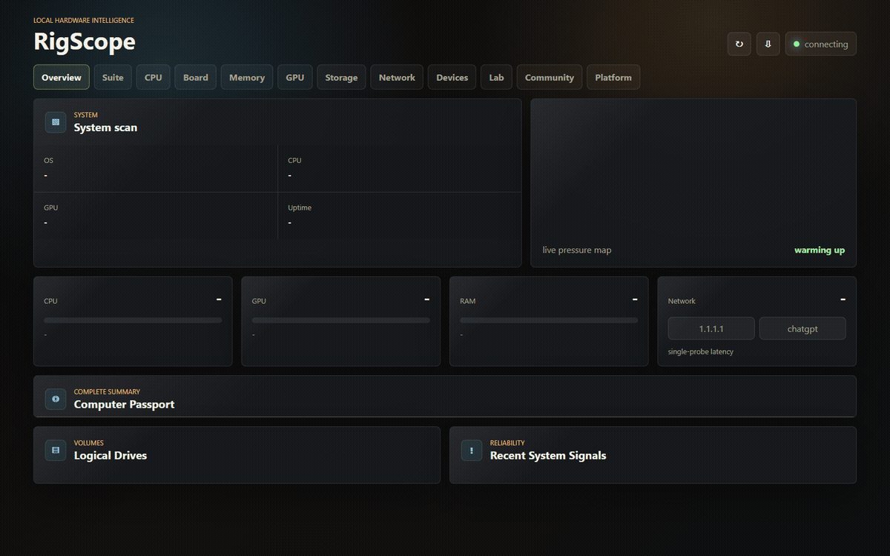

# RigScope

<p align="center">
  
</p>

<h3 align="center">One clean cockpit for your whole PC.</h3>

<p align="center">
  Hardware inventory, live telemetry, benchmarks, stress tests, native tool bridges, reports, setup comparison, and community scoring in one local-first desktop utility.
</p>

<p align="center">
  <a href="https://github.com/FaulMit/rigscope/releases/latest"></a>
  <a href="https://github.com/FaulMit/rigscope/actions/workflows/release.yml"></a>
  
  
</p>

<p align="center">
  <a href="https://github.com/FaulMit/rigscope/releases/latest"><b>Download</b></a>
  ·
  <a href="https://faulmit.github.io/rigscope/"><b>Live Demo</b></a>
  ·
  <a href="#quick-start"><b>Quick Start</b></a>
  ·
  <a href="#features"><b>Features</b></a>
  ·
  <a href="#русская-версия"><b>Русская версия</b></a>
</p>



## What Is RigScope?

RigScope is a desktop hardware utility for people who normally keep AIDA64, CPU-Z, GPU-Z, OCCT, FurMark, Prime95, MemTest, and notes open at the same time.

It gives you one place to inspect a PC, watch live telemetry, run quick benchmarks, stress CPU/RAM/GPU paths, launch allowlisted native tools, export reports, and compare setup scores.

## For Who

- PC enthusiasts validating a new build, upgrade, undervolt, or overclock.
- Repair shops and service technicians collecting a clean hardware/stability report.
- PC builders who want inventory, telemetry, benchmarks, and burn-in checks in one workflow.
- Buyers and sellers who need a transparent setup report before a used-PC deal.
- Anyone who wants a simple public score card without sharing raw inventory.

## Current Highlights

- Hosted Community scoreboard powered by Cloudflare Workers + D1.
- Static GitHub Pages demo with simulated hardware data and fake stress-test workflows.
- Successful Community sync is stored online only; local storage is used as an offline fallback.
- Faster live telemetry polling with user settings for theme and polling speed.
- Improved Lab UX, stress-test visuals, loading/status states, and native-runner logs.
- Fixed RAM/GPU stress behavior, benchmark formatting, RigScore undefined values, and scoreboard race conditions.
- Release workflow now runs tests and can generate GitHub release notes from the changelog.

## Features

### Inventory

RigScope collects a readable PC passport:

- OS, uptime, Secure Boot, VBS, hypervisor state
- motherboard, BIOS/UEFI, CPU topology, caches, virtualization
- DIMM slots, speed, configured speed, manufacturer, part numbers
- GPU adapter, driver, VRAM, clocks, power, temperature, utilization
- physical disks, volumes, file systems, health, firmware, bus/interface
- network adapters, masked MACs, IPs, gateways, DNS
- monitors, audio devices, USB, input devices, drivers, updates, and reliability signals

### Live Telemetry

- CPU load and per-thread pressure
- memory usage and pressure
- NVIDIA telemetry through `nvidia-smi` when available
- network latency probes
- system event/status summaries
- configurable polling speed, defaulting to fast desktop-friendly updates

### Lab

RigScope Lab includes:

- CPU quick benchmark
- memory throughput benchmark
- GPU render benchmark
- sensor sweep
- built-in CPU worker stress
- bounded RAM allocator stress
- browser/Electron WebGL GPU stress loop
- native external runner launcher
- RigScore and stability summary
- JSON report export

Stress tests never auto-start. They require an explicit click, show visible status/loading, and keep a stop control active during the run.

### Native Bridges

RigScope can discover installed tools and expose safe launch/status hooks:

| Tool family | Examples |
| --- | --- |
| CPU / memory stress | Prime95/mprime, y-cruncher |
| GPU stress | FurMark |
| Stability suite | OCCT |
| Sensors | HWiNFO, LibreHardwareMonitor, lm-sensors, powermetrics, NVIDIA SMI |
| Storage | smartctl, CrystalDiskInfo |
| Reference utilities | CPU-Z, GPU-Z, MemTest86 |

Native runners are opt-in and allowlisted. RigScope does not accept arbitrary executable paths from the browser UI.

### Community Scoreboard

Community sync uses the hosted RigScope scoreboard by default:

```text
https://rigscope-scoreboard.faulmit.workers.dev
```

`Save / Sync Profile` publishes only a reduced public score card:

- setup name and owner label
- RigScore
- CPU/GPU/RAM/storage summary
- OS and board
- benchmark numbers

The scoreboard backend adds challenge nonces, rate limiting, server-side profile normalization, score bounds, and setup lookup endpoints. Local storage is now only a fallback when online publishing fails.

For local scoreboard development:

```powershell
npm run scoreboard
$env:RIGSCOPE_SCOREBOARD_URL="http://127.0.0.1:8797"
npm start
```

Cloudflare deployment docs: [docs/SCOREBOARD.md](docs/SCOREBOARD.md).

## Install

Download the latest packaged release:

[github.com/FaulMit/rigscope/releases/latest](https://github.com/FaulMit/rigscope/releases/latest)

Try the static browser demo first:

[faulmit.github.io/rigscope](https://faulmit.github.io/rigscope/)

| Platform | Package |
| --- | --- |
| Windows x64 / x86 / ARM64 | `RigScope-Setup-*.exe` or `RigScope-Portable-*.exe` |
| Linux x64 / ARM64 | `.AppImage`, `.deb`, or `.tar.gz` |
| macOS Apple Silicon + Intel | Universal `.dmg` or `.zip` |

Packaged builds include auto-update support through GitHub Releases. Use the update button in the top bar to check, download, and restart into a newer release.

> Public builds are usable, but unsigned unless Windows/macOS signing secrets are configured in CI. Windows SmartScreen and macOS Gatekeeper may warn on unsigned builds.

## Quick Start

```powershell
git clone https://github.com/FaulMit/rigscope.git
cd rigscope
npm install
npm start
```

Open:

```text
http://127.0.0.1:8787
```

Desktop shell:

```powershell
npm run desktop
```

Build locally:

```powershell
npm run pack
npm run dist:win
```

## Development

```powershell
npm start                     # local server only
npm run open                  # server + default browser
npm run app                   # browser app mode
npm run desktop               # Electron shell
npm run scoreboard            # local JSON leaderboard backend
npm run scoreboard:cf:dev     # Cloudflare Worker dev server
npm run scoreboard:cf:migrate # apply D1 schema remotely
npm test                      # syntax and unit tests
npm run verify                # preflight checks
npm run pack                  # unpacked desktop build
```

The GitHub Pages demo publishes the `public/` folder and enables `demo-api.js` automatically outside localhost. It is useful for clicking through the interface, but all hardware data, benchmarks, stress tests, native runners, updates, and community sync are simulated.

If the Demo Site workflow says GitHub Pages is not enabled, open repository Settings > Pages and set Build and deployment Source to GitHub Actions, then rerun the workflow.

Release docs: [docs/RELEASE.md](docs/RELEASE.md).

## Security Model

- Local app server binds to `127.0.0.1`.
- Static files are served only from `public/`.
- CSP, frame denial, `nosniff`, and referrer protections are enabled.
- Exported reports are user-triggered.
- Native stress tools require explicit acknowledgement.
- Community publishing sends only the reduced public profile, not raw inventory.
- Cloudflare scoreboard stores an IP hash for anti-abuse, not the raw IP.

See [security_best_practices_report.md](security_best_practices_report.md) for the latest review.

## Platform Coverage

| Area | Windows | Linux | macOS |
| --- | --- | --- | --- |
| Dashboard UI | yes | yes | yes |
| Core inventory | rich PowerShell/CIM/WMI path | portable OS tools | portable OS tools |
| CPU/RAM/GPU browser tests | yes | yes | yes |
| Native runners | tool-dependent | tool-dependent | tool-dependent |
| Packages | setup, portable | AppImage, deb, tar.gz | universal dmg, zip |
| 32-bit | Windows x86 | not planned | not supported |

Windows currently has the deepest inventory. Linux and macOS open cleanly through the portable compatibility layer and can be deepened with platform bridges over time.

## Troubleshooting

| Symptom | What to check |
| --- | --- |
| `Port 8787 is already in use` | RigScope reuses an existing RigScope instance. If another app owns the port, close it or start RigScope with another `PORT`. |
| No GPU telemetry | Install/update the GPU driver and check whether `nvidia-smi` is available in PATH. |
| Native runner is disabled | Install the external tool first. RigScope only enables detected allowlisted runners. |
| Community sync says `scoreboard failed` | Check internet access and the hosted scoreboard URL. RigScope keeps an offline fallback profile when publishing fails. |
| Windows/macOS warns on launch | Preview builds are unsigned. Production signing is planned. |

## Roadmap

- stronger benchmark attestation and anomaly scoring for the public leaderboard
- deeper native profiles for OCCT/FurMark/Prime95/y-cruncher
- more Linux/macOS sensor bridges
- production code signing for Windows/macOS
- more visual polish backed by screenshot QA on desktop resolutions

## Contributing

Good contributions are practical and testable:

- bug reports with screenshots, OS version, package type, and steps to reproduce
- new hardware bridge support with graceful fallback when a tool is missing
- safer stress-test profiles with clear thermal and duration limits
- UI improvements backed by real screenshots on desktop and laptop viewports
- release/signing automation improvements

Before opening a PR, run:

```powershell
npm test
npm run verify
npm run pack
```

## Русская версия

RigScope - это локальная desktop-утилита для железа, диагностики, live telemetry, бенчмарков, стресс-тестов, отчетов и сравнения сетапов.

Идея простая: вместо AIDA64 + CPU-Z + GPU-Z + OCCT + FurMark + Prime95 + MemTest в разных окнах дать один аккуратный инструмент для проверки ПК.

Что умеет версия 1.1.0:

- показывает подробный паспорт ПК: ОС, плату, BIOS/UEFI, CPU, RAM, GPU, диски, сеть, устройства, драйверы и обновления;
- обновляет telemetry быстрее и дает настройки темы и скорости опроса;
- запускает CPU/RAM/GPU quick tests, sensor sweep и встроенные stress tests;
- умеет работать с внешними инструментами вроде OCCT, FurMark, Prime95/mprime, y-cruncher, HWiNFO и NVIDIA SMI, если они установлены;
- синхронизирует Community-профили через общий Cloudflare scoreboard;
- сохраняет локальный профиль только как offline fallback, если онлайн-синхронизация недоступна;
- экспортирует отчеты и публичный сокращенный setup profile без сырого inventory.

Быстрый запуск из исходников:

```powershell
git clone https://github.com/FaulMit/rigscope.git
cd rigscope
npm install
npm start
```

Открыть:

```text
http://127.0.0.1:8787
```

Desktop-режим:

```powershell
npm run desktop
```

Проверки перед изменениями:

```powershell
npm test
npm run verify
```

Безопасность:

- стресс-тесты не запускаются сами;
- нативные инструменты требуют явного подтверждения;
- локальный сервер слушает только `127.0.0.1`;
- Community отправляет только сокращенный публичный профиль;
- GitHub/Cloudflare секреты не хранятся в браузерном UI.

## License

MIT. See [LICENSE](LICENSE).
