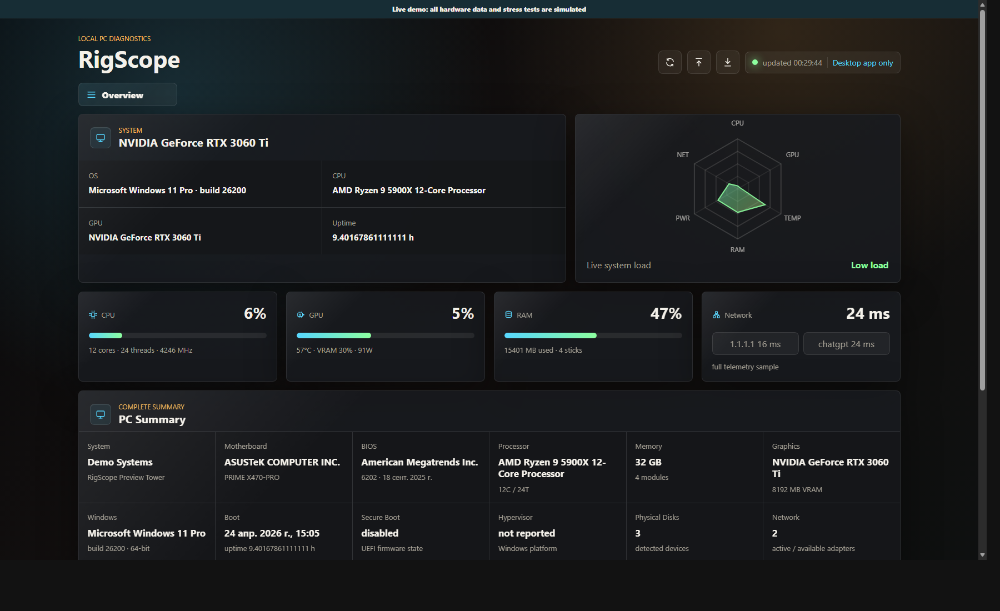
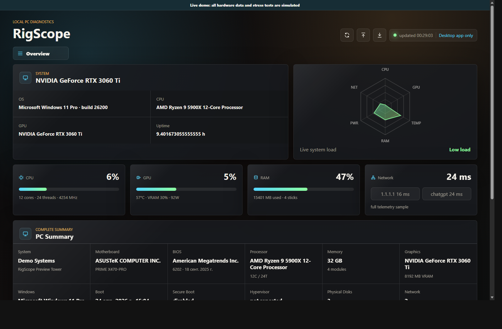
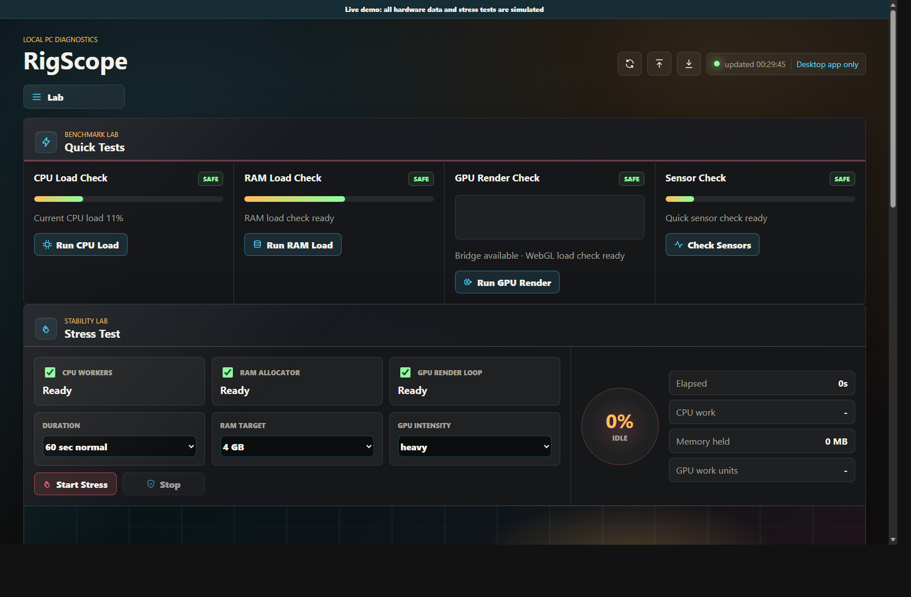
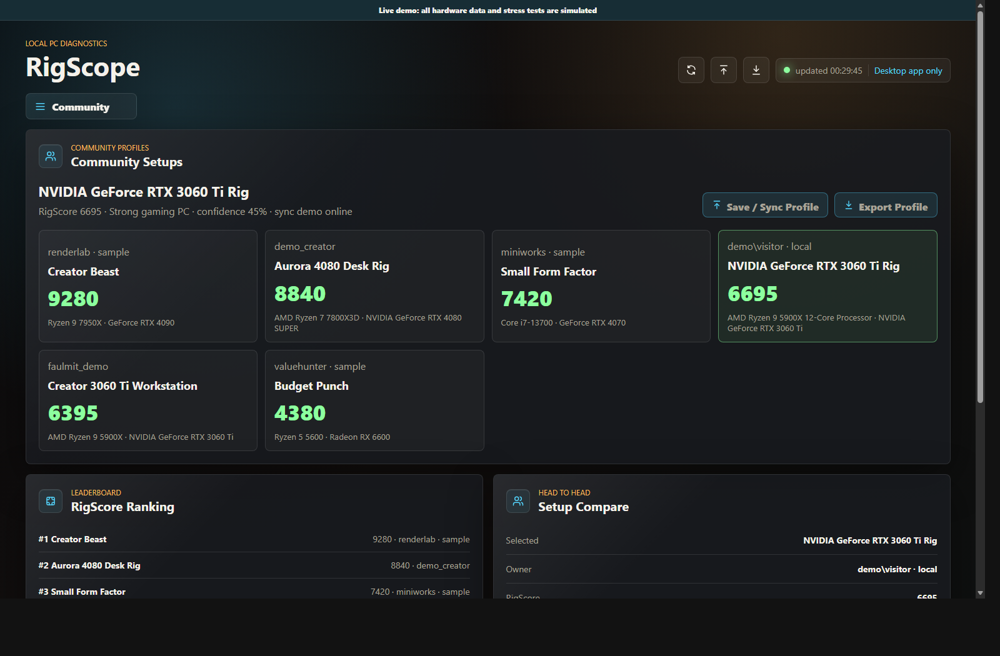
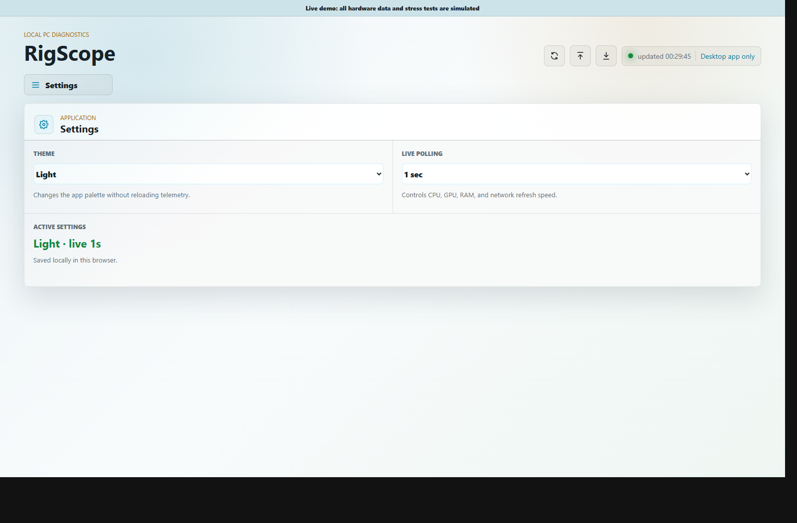

# RigScope

<p align="center">
  
</p>

<h3 align="center">Your PC, explained.</h3>

<p align="center">
  Inventory, live telemetry, benchmarks, stress tests, reports, and a public setup leaderboard in one desktop app.
</p>

<p align="center">
  <a href="https://github.com/FaulMit/rigscope/releases/latest"></a>
  <a href="https://faulmit.github.io/rigscope/"></a>
  
</p>

<p align="center">
  <a href="https://github.com/FaulMit/rigscope/releases/latest"><b>Download</b></a>
  ·
  <a href="https://faulmit.github.io/rigscope/"><b>Try Demo</b></a>
  ·
  <a href="#quick-start"><b>Run From Source</b></a>
  ·
  <a href="#русская-версия"><b>Русская версия</b></a>
</p>



## Why

PC checks are messy. One app for inventory, one for sensors, one for stress tests, screenshots everywhere, and then you still need to explain the result.

RigScope turns that into one clean flow:

1. See what is inside the PC.
2. Watch live load, temps, memory, GPU, and network.
3. Run quick CPU/RAM/GPU checks or a controlled stress test.
4. Export a report or publish a small public setup card.
5. Compare RigScore with other community setups.

## Current Highlights

<!-- RIGSCOPE:CURRENT_HIGHLIGHTS:start -->
- Live GitHub Pages demo, powered by the same UI and browser-safe simulated hardware data.
- Online Community leaderboard on Cloudflare Workers + D1, with local fallback only when sync fails.
- Cleaner desktop UX: faster telemetry, theme settings, compact navigation, readable status, and refreshed Lab visuals.
- Built-in CPU/RAM/GPU quick tests, stress flows, native runner previews, reports, and RigScore comparison.
- Release checks now keep README generated blocks and demo fixtures in sync before publishing.
<!-- RIGSCOPE:CURRENT_HIGHLIGHTS:end -->

## Screens

| Overview | Lab |
| --- | --- |
|  |  |

| Community | Light mode |
| --- | --- |
|  |  |

## What You Get

| Area | What it does |
| --- | --- |
| Hardware passport | OS, board, BIOS, CPU, RAM sticks, GPU, disks, network, monitors, USB, drivers, updates |
| Live telemetry | CPU, RAM, GPU, NVIDIA data through `nvidia-smi`, network probes, uptime, status |
| Lab | CPU/RAM/GPU quick tests, sensor sweep, built-in stress tests, stability summary, JSON report |
| Native tools | Safe profiles for OCCT, FurMark, Prime95/mprime, y-cruncher, HWiNFO, smartctl, GPU-Z, CPU-Z |
| Community | Cloudflare leaderboard, RigScore ranking, setup comparison, offline fallback |

Stress tests never auto-start. Native runners are allowlisted and require explicit confirmation.

## Community Leaderboard

RigScope publishes only a reduced public card:

- setup name and owner label
- RigScore
- CPU/GPU/RAM/storage summary
- OS and board
- benchmark numbers

Hosted scoreboard:

```text
https://rigscope-scoreboard.faulmit.workers.dev
```

The backend uses challenge nonces, rate limits, server-side normalization, score bounds, and setup lookup endpoints. If online sync fails, RigScope keeps a local fallback profile instead of pretending the upload worked.

Scoreboard docs: [docs/SCOREBOARD.md](docs/SCOREBOARD.md).

## Install

Download the latest release:

[github.com/FaulMit/rigscope/releases/latest](https://github.com/FaulMit/rigscope/releases/latest)

Try the browser demo first:

[faulmit.github.io/rigscope](https://faulmit.github.io/rigscope/)

| Platform | Packages |
| --- | --- |
| Windows x64 / x86 / ARM64 | `RigScope-Setup-*.exe`, `RigScope-Portable-*.exe` |
| Linux x64 / ARM64 | `.AppImage`, `.deb`, `.tar.gz` |
| macOS Apple Silicon + Intel | Universal `.dmg`, `.zip` |

Packaged builds include auto-update support through GitHub Releases. Use the update button in the top bar to check, download, and restart into a newer release.

> Preview builds can be unsigned unless Windows/macOS signing secrets are configured in CI.

## Quick Start

```powershell
git clone https://github.com/FaulMit/rigscope.git
cd rigscope
npm install
npm start
```

Open:

```text
http://127.0.0.1:8787
```

Desktop shell:

```powershell
npm run desktop
```

## Demo Site

<!-- RIGSCOPE:DEMO_NOTE:start -->
The GitHub Pages demo publishes the real `public/` UI and turns on `demo-api.js` outside localhost. You can click through the app in a browser, but hardware data, benchmarks, stress tests, native runners, updates, and community sync are simulated.

If the Demo Site workflow says GitHub Pages is not enabled, open repository Settings > Pages and set Build and deployment Source to GitHub Actions, then rerun the workflow.
<!-- RIGSCOPE:DEMO_NOTE:end -->

## Development

```powershell
npm start                      # local server
npm run open                   # server + browser
npm run desktop                # Electron shell
npm run scoreboard             # local JSON scoreboard
npm run scoreboard:cf:dev      # Cloudflare Worker dev
npm run sync:docs              # sync README generated blocks + demo fixtures
npm run check:docs             # check generated docs
npm test                       # syntax + unit tests
npm run verify                 # release preflight
```

Release docs: [docs/RELEASE.md](docs/RELEASE.md).

## Security

- Local app server binds to `127.0.0.1`.
- Static files are served only from `public/`.
- CSP, frame denial, `nosniff`, and referrer protections are enabled.
- Native stress tools require explicit acknowledgement.
- Community sync sends only the reduced public profile, not raw inventory.
- Cloudflare scoreboard stores an IP hash for anti-abuse, not the raw IP.

## Roadmap

- stronger leaderboard anti-cheat and anomaly scoring
- deeper OCCT/FurMark/Prime95/y-cruncher profiles
- more Linux/macOS sensor bridges
- production code signing for Windows/macOS
- more screenshot-backed UI polish

## Русская версия

RigScope - это desktop-приложение для проверки ПК: железо, live telemetry, бенчмарки, стресс-тесты, отчеты и Community leaderboard.

Коротко:

- показывает, что стоит в компьютере;
- быстро обновляет CPU/RAM/GPU/Network данные;
- запускает CPU/RAM/GPU quick tests и контролируемые stress tests;
- умеет работать с внешними инструментами вроде OCCT, FurMark, Prime95, HWiNFO и NVIDIA SMI;
- синхронизирует публичные setup-карточки через Cloudflare scoreboard;
- не отправляет сырой inventory в Community.

Запуск из исходников:

```powershell
git clone https://github.com/FaulMit/rigscope.git
cd rigscope
npm install
npm start
```

Демо:

[faulmit.github.io/rigscope](https://faulmit.github.io/rigscope/)

## License

MIT. See [LICENSE](LICENSE).
